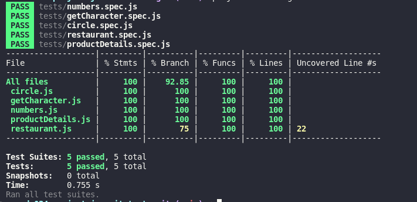

# <p align="center">Projeto ES6 e Testes Unitários!</p>

## Contexto

O objetivo desse projeto foi utilizar o `Jest` para escrever `testes unitários` que verifiquem o funcionamento adequado de funções, adotando o `TDD` Desenvolvimento Orientado a Testes.

## Rode o projeto localmente

>⚠️ É preciso ter o [Node](https://nodejs.org/en) instalado em sua máquina.

Primeiro, instale as dependências com:

```SHELL
npm install
```

Rode todos os testes com:

Esse projeto não tem front-end, apenas os testes em `Jest`.

```SHELL
npm test
```
Um teste por vez, acrescentando o nome do test/spec:

```SHELL
npm test numbers
```

### cobertura jest



## Competências desenvolvidas

- Capacidade escrever funções para testes já criados.
- Capacidade de `escrever testes` para funções já criadas.
- Capacidade de realizar o `TDD` Desenvolvimento Orientado a Testes.
